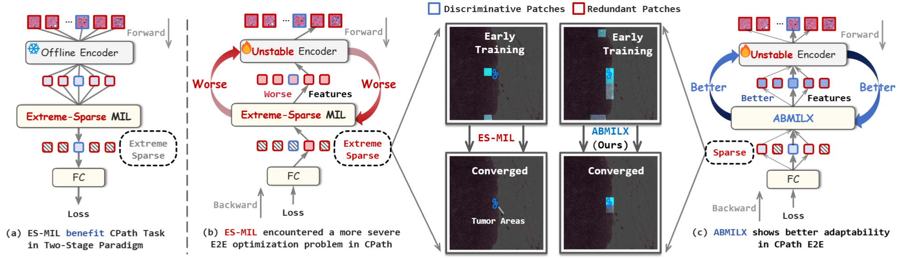
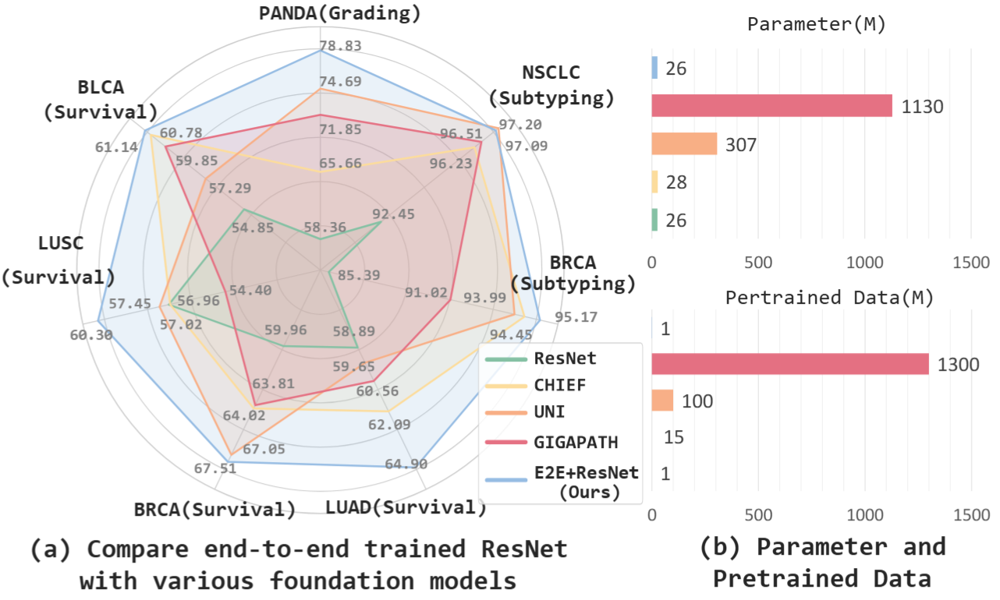

# ABMILX: Revisiting End-to-End Learning with Slide-level Supervision in Computational Pathology

**Official PyTorch Implementation for "Revisiting End-to-End Learning with Slide-level Supervision in Computational Pathology"**

[[arXiv Paper]](https://arxiv.org/abs/2506.02408)

<p align="center">
  
</p>

> We pioneer the elucidation of the E2E optimization challenges caused by sparse-attention MIL and propose a novel MIL approach called **ABMILX**. An ***E2E trained ResNet with ABMILX surpasses SOTA foundation models*** under the two-stage paradigm across multiple challenging benchmarks, while remaining computationally efficient (**< 10 RTX3090 hours**).

<p align="center">
  
</p>


## Installation

We recommend using Docker for a reproducible environment. Alternatively, you can install dependencies via PyPI.

### Option 1: Docker (Recommended)

1.  Download the Docker Image: [Docker Image Link](https://pan.baidu.com/s/1fC7T5GKBb3gMaHUIk_Ibuw?pwd=2025) (Password: 2025)
2.  Load the Docker image:
    ```bash
    docker load -i XXX.tar
    ```
    (Replace `XXX.tar` with the downloaded file name.)
3.  Run the Docker container:
    ```bash
    docker run --gpus all -it --ipc=host --ulimit memlock=-1 --ulimit stack=67108864\
                -v /path/to/your_code:/workspace/code \
                -v /path/to/your_data:/workspace/dataset \
                -v /path/to/your_output:/workspace/output \
                --name e2e \
                --runtime=nvidia \
                -e NVIDIA_VISIBLE_DEVICES=all \
                -e NVIDIA_DRIVER_CAPABILITIES=compute,utility \
                -d e2e_abmilx:latest /bin/bash
    ```
### Option 2: PyPI

1.  Create a new Python environment (e.g., using Conda, Optional):
    ```bash
    conda create -n abmilx python=3.9
    conda activate abmilx
    ```
2.  Install the required packages. Key dependencies include:
    *   `jpeg4py`
    *   `lmdb`
    *   `PyTurboJPEG`
    *   `scikit-survival`
    *   `torch >= 2.5.1`, `torchvision` (ensure compatibility with your CUDA version)

    A complete list of requirements can be found in [requirements.txt](./requirements.txt).
    ```bash
    pip install -r requirements.txt
    ```

## Data Preparation

### Download Preprocessed Data

We provide preprocessed data for all datasets in LMDB format. You can download them from:
[Baidu Netdisk](https://pan.baidu.com/s/1H0P024gRIPgi3Xeu-xPLUg?pwd=t179) (Password: t179)

### Preprocess Raw Data

If you have raw Whole-Slide Image (WSI) data, you can preprocess it as follows:

1.  **Patching (following [CLAM](https://github.com/mahmoodlab/CLAM/))**:

    ```bash
    # Example for PANDA dataset (X40 magnification):
    # --patch_size 256 --step_size 256 --patch_level=0
    # Example for PANDA dataset (X20 magnification):
    # --patch_size 512 --step_size 512 --patch_level=0
    # Example for other datasets (X10 magnification):
    # --patch_size 256 --step_size 256 --patch_level=1
    # Example for other datasets (X5 magnification):
    # --patch_size 512 --step_size 512 --patch_level=1

    python CLAM/create_patches_fp.py --source YOUR_DATA_DIRECTORY \
                                     --save_dir YOUR_RESULTS_DIRECTORY \
                                     --patch_size 256 \
                                     --step_size 256 \
                                     --patch_level 0 \
                                     --preset YOUR_PRESET_FILE \
                                     --seg \
                                     --patch
    ```
    *Replace placeholders like `YOUR_DATA_DIRECTORY` with your actual paths and parameters.*

2.  **Saving Patches into LMDB**:

    ```bash
    # Ensure img_size is 256 for training and 224 for testing/evaluation.
    python CLAM/save_patches.py --data_h5_dir H5_PATCHES_DIRECTORY \
                                --data_slide_dir WSI_DIRECTORY \
                                --csv_path PATH_TO/process_list_autogen.csv \
                                --patch_dir LMDB_OUTPUT_DIRECTORY \
                                --batch_size 1024 \
                                --slide_ext .tif \
                                --save_lmdb \
                                --img_size 256 \
                                --lmdb_name my_dataset_256_level0 \
                                --workers 6
    ```
    *Adjust parameters like `H5_PATCHES_DIRECTORY`, `LMDB_OUTPUT_DIRECTORY`, and `lmdb_name` accordingly.*

### LMDB Dataset Details

The LMDB database stores image patches and associated metadata.

#### 1. Metadata Fields

These fields provide summary information about the dataset, serialized using `pickle`.

*   `b'__keys__'`: A list of unique keys for each image patch (e.g., `b'{slide_id}-{patch_index}'`).
*   `b'__len__'`: Total number of image patches.
*   `b'__slide__'`: A list of all unique `slide_id`s.
*   `b'__pn__'` (Patch Number per Slide): A dictionary mapping `slide_id` to its patch count.

#### 2. Image Patch Data

*   **Key**: `b'{slide_id}-{patch_index}'`.
*   **Value**: The image patch data.

### Example of Loading Data

Use the following snippet to load data from an LMDB dataset:

```python
import lmdb
import torch
import pickle
from datasets.utils import imfrombytes # Ensure this utility function is correctly referenced

slide_name = "xxxx"  # Example slide name
path_to_lmdb = "YOUR_PATH_TO_LMDB_FILE" # e.g., "/path/to/my_dataset_256_level0.lmdb"

# Open LMDB dataset
env = lmdb.open(path_to_lmdb, subdir=False, readonly=True, lock=False, 
                readahead=False, meminit=False, map_size=100 * (1024**3))

with env.begin(write=False) as txn:
    # Get patch count for the slide
    pn_dict = pickle.loads(txn.get(b'__pn__'))
    if slide_name not in pn_dict:
        raise ValueError(f"Slide ID {slide_name} not found in LMDB metadata.")
    num_patches = pn_dict[slide_name]
    
    # Generate patch IDs
    patch_ids = [f"{slide_name}-{i}" for i in range(num_patches)]

    # Allocate memory for patches (adjust dimensions and dtype as needed)
    # Assuming patches are 224x224, 3 channels, and will be normalized later
    patches_tensor = torch.empty((len(patch_ids), 3, 224, 224), dtype=torch.float32)

    # Load and decode data into torch.tensor
    for i, key_str in enumerate(patch_ids):
        patch_bytes = txn.get(key_str.encode('ascii'))
        if patch_bytes is None:
            print(f"Warning: Key {key_str} not found in LMDB.")
            continue
        # Assuming the stored value is pickled image bytes
        img_array = imfrombytes(pickle.loads(patch_bytes).tobytes()) # Or .tobytes() if it's already bytes
        patches_tensor[i] = torch.from_numpy(img_array.transpose(2, 0, 1)) # HWC to CHW

# Normalize the data (example using ImageNet stats)
# Ensure values are in [0, 255] before this normalization if they aren't already
mean = torch.tensor([0.485, 0.456, 0.406]).view((1, 3, 1, 1)) * 255.0
std = torch.tensor([0.229, 0.224, 0.225]).view((1, 3, 1, 1)) * 255.0

# If your patches_tensor is already in [0,1] range, remove * 255.0 from mean/std
# If your patches_tensor is uint8 [0,255], convert to float first: patches_tensor.float()
patches_tensor = (patches_tensor.float() - mean) / std

env.close()
```

## Training

### Train ResNet with ABMILX in End-to-End Framework

Use `train_dist.sh` for distributed training.

*   **Script**: `train_dist.sh $NUM_GPUS`
*   **Model**: `--model e2e_{encoder}_{mil}` (e.g., `e2e_r18_abmilx`)
*   **Config**: `-c path/to/config.yaml` (See [config/e2e/](config/e2e/) for important benchmarks)
*   **Dataset**: `--datasets {panda, brca, nsclc, call, surv_xxx}`

**Commands:**

*   **PANDA**:
    ```bash
    bash train_dist.sh 2 --datasets=panda --project=MyProjectName \
    --dataset_root=$PATH_TO_HIGH_LEVEL_DATA --dataset_sub_root=$PATH_TO_LOW_LEVEL_DATA \
    --csv_path=labels/panda.csv --model=e2e_r18_abmilx \
    --output_path=results/panda_e2e_r18_abmilx -c=config/e2e/r18_panda.yaml \
    --title=r18_panda_e2e_abmilx --wandb
    ```

*   **TCGA-BRCA-Subtyping**:
    ```bash
    bash train_dist.sh 2 --datasets=brca --project=MyProjectName \
    --dataset_root=$PATH_TO_HIGH_LEVEL_DATA --dataset_sub_root=$PATH_TO_LOW_LEVEL_DATA \
    --csv_path=labels/subtyping_tcga_brca_resample.csv --model=e2e_r18_abmilx \
    --output_path=results/brca_subtyping_e2e_r18_abmilx -c=config/e2e/r18_brca_subtyping.yaml \
    --title=r18_brca_subtyping_e2e_abmilx --wandb
    ```

*   **TCGA-BRCA-Survival**:
    ```bash
    bash train_dist.sh 2 --datasets=surv_brca --project=MyProjectName \
    --dataset_root=$PATH_TO_HIGH_LEVEL_DATA --dataset_sub_root=$PATH_TO_LOW_LEVEL_DATA \
    --csv_path=labels/survival_tcga_brca_3fold --model=e2e_r18_abmilx \
    --output_path=results/brca_survival_e2e_r18_abmilx -c=config/e2e/r18_brca_survival.yaml \
    --title=r18_brca_survival_e2e_abmilx --wandb
    ```
### Train MILs in Two-Stage Framework

1.  **Download Pre-extracted Features** (Optional):
    [Baidu Netdisk Link](https://pan.baidu.com/s/1w2JsUFRkqaQrE-6w0C6qPQ?pwd=5gf4) (Password: 5gf4)

2.  **Extract Features Yourself** (Optional):
    Follow instructions from feature extraction frameworks like [TRIDENT](https://github.com/mahmoodlab/TRIDENT) or adapt the feature extraction part of [CLAM](https://github.com/mahmoodlab/CLAM/).

3.  **Train MIL Model**:
    ```bash
    bash train.sh --datasets=panda --project=MyProjectName \
    --output_path=results/panda_feat_abmil --dataset_root=$PATH_TO_FEATURES_DIRECTORY \
    --csv_path=labels/panda.csv --model=abmil -c=config/feat/fm_panda.yaml \
    --title=panda_feat_abmil --wandb
    ```

## Use ABMILX in Two-Stage Framework

Example of integrating `DAttentionX` into your two-stage pipeline:

```python
from modules.abmilx import DAttentionX 

# Example instantiation
abmilx_model = DAttentionX(
    input_dim=1024,       # Dimension of input features (e.g., from ResNet)
    n_classes=2,          # Number of output classes
    mil_bias=True,
    attn_bias=True,
    n_heads=8             # Number of attention heads; sweep {2, 4, 8, 16} for best performance
)

# For a single bag, shape would be (1, N, D)
# example_features = torch.randn(1, 1000, 1024) # 1 bag, 1000 instances, 1024 feature dimension
# bag_prediction = abmilx_model(example_features) # Output shape: (1, n_classes)
```

## Citing ABMILX

If you find this repository useful for your research, please consider citing our paper:

```bibtex
@misc{tang2025revisitingendtoendlearningslidelevel,
      title={Revisiting End-to-End Learning with Slide-level Supervision in Computational Pathology}, 
      author={Wenhao Tang and Rong Qin and Heng Fang and Fengtao Zhou and Hao Chen and Xiang Li and Ming-Ming Cheng},
      year={2025},
      eprint={2506.02408},
      archivePrefix={arXiv},
      primaryClass={cs.CV},
      url={https://arxiv.org/abs/2506.02408}, 
}
```
## Contact

For questions or issues, please open an issue on GitHub or contact [Wenhao Tang](mailto:whtang@mail.nankai.edu.cn).

